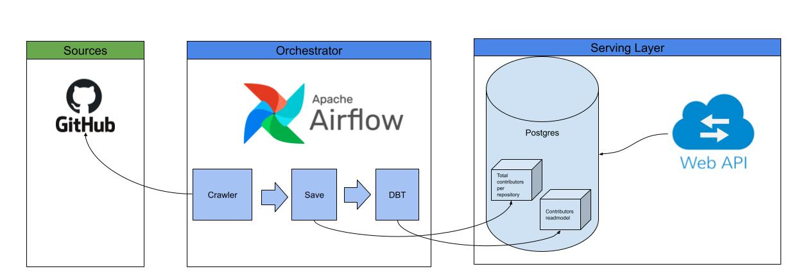
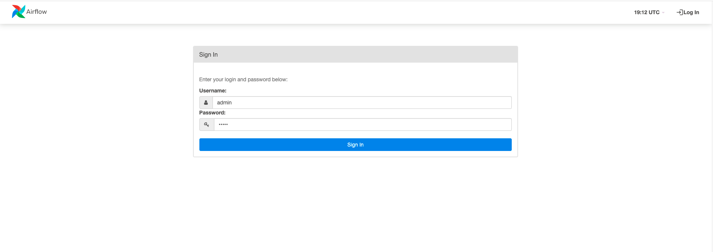
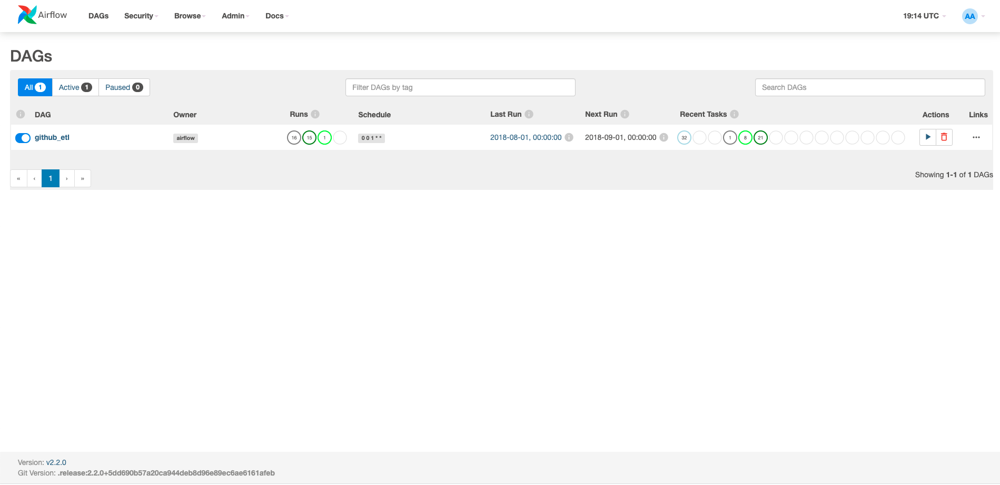
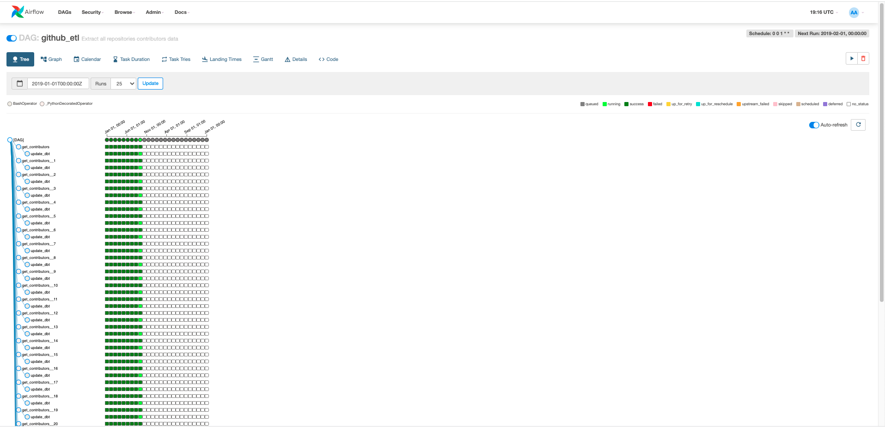

# git-collector-dw

## Summary

This challenge is a straightforward example of how to use state-of-art data engineering tools to do a crawler data pipeline system.
In the following content was used Airflow orchestration was to periodically crawl data from Github API and save it Postgres database.
In order to ensure a fast access layer to have pre-calculated aggregations, it was introduced the DBT incremental materialized table.
The materialized content is served by Flask API with a paginated endpoint.

## System Design

### Requirements:
- Use Github API to collect all contributors data of a bunch of repositories in a specific account.
- Aggregate Github API data in order to materialize the number of first contributors on a month per repository.
- Have a retry strategy for postponed requests(202) and rate limit exceeded.
- Have a updaded read model avoiding aggregations on serving layer.

### Assumptions
- The data freshness is 24 hours according to the scheduler run.
- When Github rate limit is exceeded the task waits for the next reset window.
- When Github responds of `202` status code which is normally a `report on creation` response, the task retry after 30 seconds of backoff with a total of 20 max retries.
- Any other response status code than `200` and `204` is retryable.
- In case of a new repository is added to the account it will be added on the DAG 24 hours later(cache ttl).

### Big picture



#### Features

- Airflow dag runs every day collecting new contributors data.
- Orchestrator allows to paralellize the processing and deals with all resiliency with case of a request failure.
- After each dag run the DBT read model is updated.
- DBT table is incremental by month, thus only all records of the current month are updated. 
  
#### Github API

Crawling on Github API was made from the following endpoints:

[List organization repositories](https://docs.github.com/en/rest/reference/repos#list-organization-repositories)
`````
GET /orgs/{org}/repos
`````

[Get all contributor commit activity](https://docs.github.com/en/rest/reference/repos#get-all-contributor-commit-activity)
`````
GET /repos/{owner}/{repo}/stats/contributor
`````

## How to run

### Requirements
- Docker and Docker-compose

### Step 1
All environments variables can be modified on the `.env` file

<b>Required(*):</b>
````
AIRFLOW_VAR_GITHUB_ACCESS_TOKEN=<MY_ACCESS_TOKEN>
````
Don't know to create a github access token? Take a look on this github [doc](https://docs.github.com/en/authentication/keeping-your-account-and-data-secure/creating-a-personal-access-token)

<b>*</b> Feel free to not set up an access token however keep in mind that the rate limit requests by IP address are 60 requests.

<b>Optional</b>

The default account name to use the crawler is `facebook` however you can change the following env var:
`````
AIRFLOW_VAR_GITHUB_REPO_OWNER=<MT_GITHUB_ACCOUNT_NAME>
`````

The cache ttl hours for the repositories list can be set up by:
`````
AIRFLOW_VAR_GITHUB_CACHE_TTL=24
`````

### Step 2
Bootstrap the docker-compose environment using the following command on project root folder
````
docker-compose up api airflow-webserver airflow-scheduler
````

### Step 3
Access the Airflow UI to check the dag creation using the `localhost:8080`.  
<b>Note</b>: The Airflow webserver should take a few minutes to startup.



Default username and password is `admin`

### Step 4
Validate the DAG (Directed Acyclic Graph) creation, and if all works well the backfill since 2016 year should be started.




### Step 5
Now we can use the Flask API to get paginated requests of our contributors read model.

Request example
`````
curl -X GET "http://localhost:5000/api/repos?page=1&page_size=3"
`````

Response
`````
{
  "items": [
    {
      "month": "2016-01-01",
      "number_of_new_contributors": 1,
      "repo_name": "buck"
    },
    {
      "month": "2016-01-01",
      "number_of_new_contributors": 1,
      "repo_name": "facebook-android-sdk"
    },
    {
      "month": "2016-01-01",
      "number_of_new_contributors": 1,
      "repo_name": "facebook-php-business-sdk"
    }
  ],
  "page": 1,
  "page_size": 3,
  "total_records": 291
}
`````

## How to run the tests

DAG Unit tests
`````
docker-compose run tests_dags
`````

WebAPI Integration tests
`````
docker-compose run tests_api
`````

## Author
@asantoz 

- [Linkedin](https://www.linkedin.com/in/asantoz/)
- [Github](https://github.com/asantoz)

